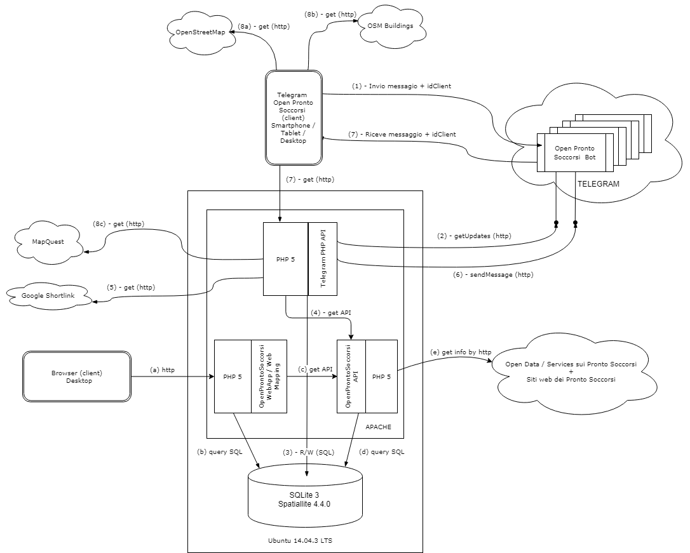
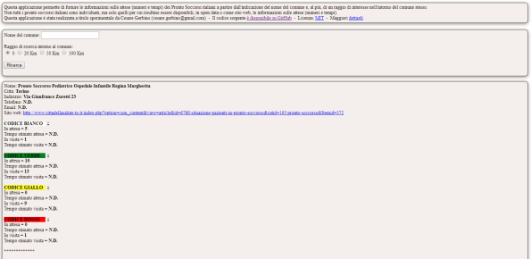
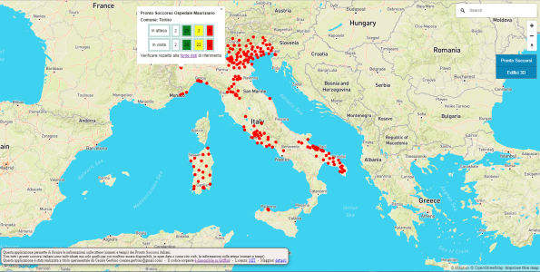

## Progetto Open Pronto Soccorsi

Il progetto Open Pronto Soccorsi mira a rendere disponibli le informazioni sulle attese (numeri e tempi) dei Pronto Soccorsi italiani.

Non tutti i pronto soccorsi italiani sono individuati ma solo quelli per cui risultino essere disponibili, in open data o come sito web, le informazioni sulle attese (numeri e tempi)

Schematicamente l’architettura della soluzione è la seguente:

Nel diagramma sono citati i vari componenti del sistema che:

- è ospitato su una macchina Ubuntu 14.0.4 LTS
- utilizza come database SQLite3 + Spatialite 4.4.0
- si avvale di servizi di [OpenStreetMap](http://www.openstreetmap.org), [OSM Buildings](https://osmbuildings.org/), [MapQuest](https://www.mapquest.com/) e [Google ShortLink](https://goo.gl/)

Si tratta di una soluzione che utilizza tutti software open source e attinge da servizi disponibili in rete.

L'intero sistema, come indicato in figura può essere ospitato su un unico nodo Apache + PHP5.

Nella configurazione attuale del sistema questo è stato diviso su due nodi: sul primo è presente la sola parte di esposizione delle API (rif. http://www.webglobes.org/cesarefortelegram/Telegram/OpenProntoSoccorsi/API/getProntoSoccorsoDetailsByMunicipality.php?municipality=Torino&distance=0), e la parte "server" del bot Telegram, sul secondo sono presenti le web application (rif. http://www.cesaregerbino.com/OpenProntoSoccorsi/WebApp/OpenProntoSoccorsiResults.php e http://www.cesaregerbino.com/OpenProntoSoccorsi/WebMapping/OpenProntoSoccorsi.php).

Le informazioni sono rese disponibili via API in formato JSON: un esempio, utilizzabile, di quanto illustrato sopra è consultabile "live" al seguente indirizzo web:
http://www.webglobes.org/cesarefortelegram/Telegram/OpenProntoSoccorsi/API/getProntoSoccorsoDetailsByMunicipality.php?municipality=Torino&distance=0

dove è possibile modificare il nome del comune e in cui il parametro distance indica, se valorizzato a zero, che la ricerca viene svolta per i pronto soccorsi che si trovano all'interno del territorio comunale del comune indicato, altrimenti permette di fare una ricerca nell'intorno del comune stesso, ad esempio distance=10000 indica una ricerca nell'intorno di 10 km dal comune indicato.

Seppur non oggetto principale delle attività, a partire dei servizi di OpenProntoSoccorsi, e per rendere fruibili queste informazioni, ho provato ad implementare alcune applicazioni di esempio e precisamente:

- una semplice web application che, immettendo il nome del comune di interesse ed un raggio di ricerca nel suo intorno restituisce l'elenco dei pronto soccorsi con relative info sui numeri e tempi di attese per tipologia (rif. http://www.cesaregerbino.com/OpenProntoSoccorsi/WebApp/OpenProntoSoccorsiForm.php )

- un'applicazione di web mapping che permette di visualizzare la distribuzione sul territorio italiano dei pronto soccorsi di cui si è riusciti ad individuare la pubblicazione dei dati sui numeri e tempi di attese per tipologia, e di interrogare interattivamente i dati del singolo pronto soccorso (rif. http://www.cesaregerbino.com/OpenProntoSoccorsi/WebMapping/OpenProntoSoccorsi.php )

- un bot telegram (OpenProntoSoccorsiBot), in cui è possibile indicare il nome del comune di interesse ed un raggio di ricerca nel suo intorno e che restituisce l'elenco dei pronto soccorsi con relative info sui numeri e tempi di attese per tipologia. E' anche possibile indicare la posizione, ed un raggio di ricerca nel suo intorno, ed ottenere il medesimo risultato: in questo caso il bot permette anche di avere l'informazione del percorso per raggiungere il pronto soccorso di interesse tra quelli proposti

Per approfondimenti e dettagli:
- https://cesaregerbino.wordpress.com/2018/07/24/open-pronto-soccorsi-rendere-disponibili-ed-accessibili-i-dati-di-numeri-e-tempi-di-attesa-per-tipologia-dei-pronto-soccorsi-italiani/
- https://cesaregerbino.wordpress.com/2018/07/24/open-pronto-soccorsi-come-e-fatto-dentro/
